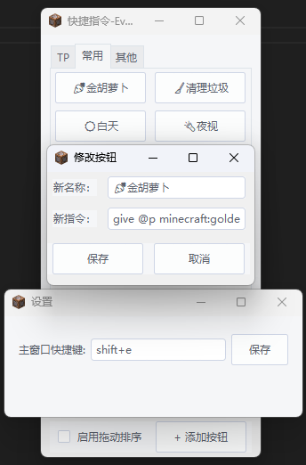

# QuickCommand 快捷指令
### 基于python的用于快速发送Minecraft指令的工具

### 基础操作
在游戏中任意单层界面(点击一次esc即可恢复到正常游戏的状态，如普通esc界面，背包界面等)或正常游戏状态
使用快捷键Shift+E唤起快捷指令界面，点击任意指令即可自动执行发送

### 设置快捷指令
点击添加按钮选项，输入按钮名称和对应要执行的指令即可创建指令按钮
Ps：输入指令界面无需"/"，只需输入对应指令

### 自定义快捷键
右键系统托盘，点击设置即可修改快捷键

### ToDoList
- ✅快捷指令按钮的修改、删除功能
- ✅自定义快捷键功能
- ✅按钮自适应窗口宽度
- ⏳保存窗口位置、大小
- ⏳不只执行指令，打开文件夹、运行命令等
